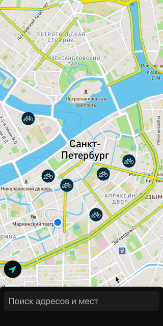

# bike_navigator
Development of a mobile application for cyclists on the iOS platform

Application presents bike lanes and bike parkings of Saint-Petersburg. It allows to select a coordinate by searching an address or by selecting it on a map. Then it builds two routes: the quickest and the safest.




# How to run

To run this app localy firstly you need to configure MapBox credentials using this [Guide](https://docs.mapbox.com/ios/maps/guides/install/#configure-credentials)

Then you need to clone the repo and download required packages since
app is using CocoaPods as a package manager:
```sh
git clone https://github.com/Diploma-works/bike_navigator.git
cd bike_navigator
pod install
```
When download is completed just run .xcworkspace file in Xcode.
It also will take some time to download some packages that was added using SPM. After that you are ready to run the app.
